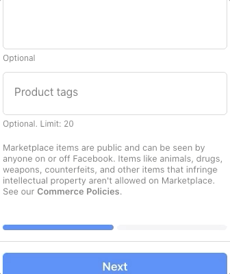

# Facebook Marketplace Tags Fields Replica

Replicate the behaviour of the Facebook Marketplace Tags field. This field is used in the Item For Sale form to add tags to something you want to list/sell in the Facebook market place at https://www.facebook.com/marketplace/create/item

## Demo

## Criteria
* Built from Scratch. You should not have to use any 3rd Party libraries or packages.
* Write your own CSS. 
* The closer your visuals to Facebook’s the better.
* Can be implemented in React or in Vanilla JavaScript, HTML & CSS
* Clean and readable implementation following best practices.
* Must have a pleasant User Experience with emphasis in accessibility. e.g can a user add a tag only with the keyboard?
* Your solution must:
  * Be deployed as a standalone front-end project. 
  * Have a GitHub Repo with short README describing the project and link to live version.

## Final Notes
* This would make an nice and eye-catching mini project for you portfolio, specially if you like Front-End development & UI/UX.
* You are welcome & encouraged to demo your implementation and code in our class check-in.
